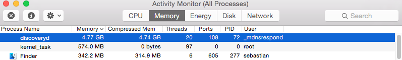

# mac-os-tips
A collection of useful things concerning Mac OS X

## Slow Terminal Login and Cleaning Log Files

If you are experiencing that it takes a long time to open a new login shell, one reason could be the accumulation of system log files in the directory 

    /private/var/log/asl/
    

In my case, I could bring my terminal back to speed by simply deleting those `.asl` log files via:

	cd /private/var/log/asl/
	sudo rm *.asl 
	
	
 
 

## Installing GNU compilers

#### 1.

First, you need to [download Apple's XCode IDE](https://itunes.apple.com/us/app/xcode/id497799835?mt=12) from the Mac App Store. After you installed XCode, open a new terminal window and install the XCode command line utilities via 

	xcode-select --install 
	
	
#### 2. 

You can find the latest GCC version on [HPC Mac OS X](http://hpc.sourceforge.net), and after you downloaded the zipped tarball, e.g., `gcc-5.0-bin.tar.gz`, you can unzip it from the download directory via

	gunzip gcc-5.0-bin.tar.gz

and install it to `/usr/local/bin` via executing

	sudo tar -xvf gcc-5.0-bin.tar -C /
	
	
#### 3. 

Test if the newly installed `gcc` is the default on your system by executing

	which gcc

which should return

	/usr/local/bin/gcc
	

Otherwise you may want to add `/usr/local/bin/gcc` to your `PATH`, e.g., via

	export PATH=/usr/local/bin:$PATH' >> ~/.bash_profile
	
	
 
 

## When the discoveryd process get's out of control

Especially since the upgrade to OS X Yosemite (10.10) it can happen that the discoveryd (the "new" mDNSResponder) process goes crazy and uses up all the memory on your machine and renders it unresponsive and impossible to use productively. 

In my experience, it usually helped to just `unload` discoveryd via 

    sudo launchctl unload -w /System/Library/LaunchDaemons/com.apple.discoveryd.plist

and then reload it via

    sudo launchctl load -w /System/Library/LaunchDaemons/com.apple.discoveryd.plist

 
 

## Show and hide invisible files in Finder

Invisible files are hidden in the Finder by default. To display hidden files, simply open a new terminal window and execute the command

    defaults write com.apple.finder AppleShowAllFiles NO

And to hide the invisible files again, execute

    defaults write com.apple.finder AppleShowAllFiles YES

To apply those changes, you need to relaunch the Finder. This can be done by clicking on the "Apple" button in the top-left corner of your screen, opening the "Force Quit" menu, selecting the "Finder" entry, and clicking on the "Relaunch" button.

